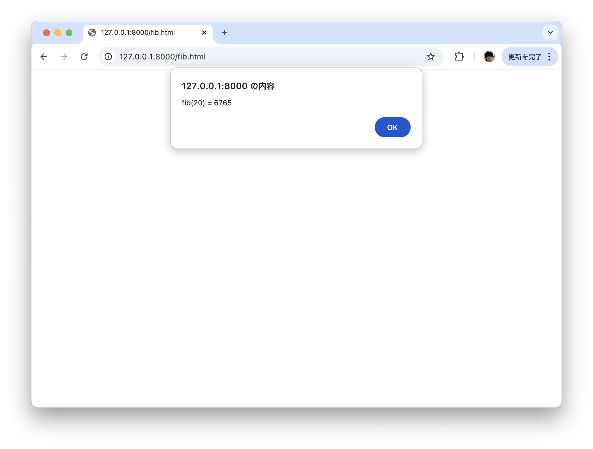
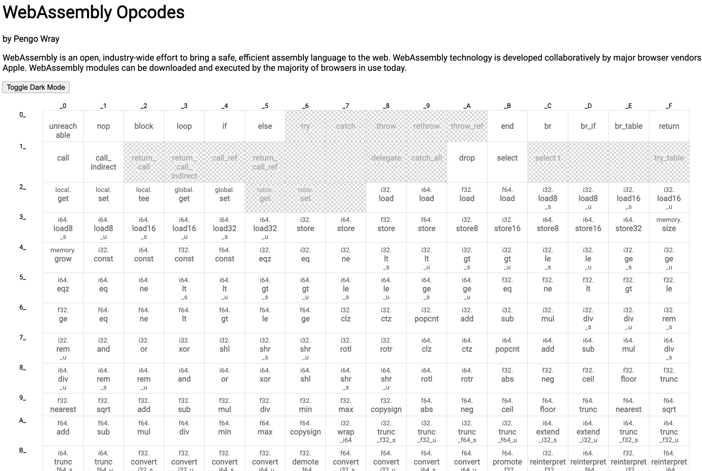

# 超入門WebAssembly<br>（のランタイムをRubyで書く方法）

---

# 自己紹介

- Uchio Kondo
- @udzura

---

# 最近の生活

- 趣味: VM実装になりつつある...

---

# mruby/edge

- Rustで書いたmrubyランタイム（mruby 3.x のバイトコードを実行可能）
- 基本的にmruby/cをベースにしている（一部必要な機能はmrubyから移植したい）

---

# Wardite

- Rubyで書いたWebAssemblyランタイム

---

# 今日は Wardite の話をします

---

# 前提: WebAssembly とは

---

# WebAssembly とは

- ブラウザで動くバイナリフォーマット
- バイトコードをいろいろな言語（C, C++, Rust, ...）からコンパイルして、そのプログラムをブラウザの上で実行できる

---

# WebAssembly とは

- ~~ブラウザで~~ いろいろなところで動くバイナリフォーマット

---

# WebAssembly のメリット

- 言語を選ばずにバイナリを作れる
- そのバイナリは、ブラウザを中心にいろいろなところで動かせる
    - Write Once, Run Anywhere なのじゃよ...
- 多くのランタイムで高速に動くことが期待できる
  - （安全性等もメリットですが今日は割愛）

---

# さて、Wardite

---

# Wardite の特徴

- Pure Ruby 製
  - 標準添付ライブラリ以外に動作上の依存ライブラリはなし
- Fully RBS annotated (rbs-inline)

<!-- ちなみに標準添付ライブラリもstringioだけです。これも削っちゃおうかな？ -->

---

`<!--`

# 名前の由来

- `WA` で始まる鉱石の名前を探して、それを採用した
- ワード石: NaAl<sub>3</sub>(PO<sub>4</sub>)<sub>2</sub>(OH)<sub>4</sub>2(H<sub>2</sub>O)
- [Image CC BY-SA 4.0](https://en.wikipedia.org/wiki/Wardite#/media/File:Wardite.jpg)

`-->`

---

# なぜ Ruby で WebAssembly ランタイムを書くのか

- C拡張ベースの組み込みWebAssembly ランタイムなら実際結構ある
    - Wasmtime, Wasmedge, Wasmer, ...
- 速度面でも強みはあるでしょう...

---

# でも...

- みなさん、このメッセージ好きですか？

```
Building native extensions. This could take a while...
```

---

# cf. [wazero](https://github.com/tetratelabs/wazero)

- Pure Go の WebAssembly ランタイム
- cgo を避けたいGoのコミュニティで受け入れられている
    - wazero + tinygo でGoだけのプラグイン機構があったりする
    - https://github.com/knqyf263/go-plugin

---

# Pure Rubyであることのメリット

- インストール・セットアップが簡単
    - Rubyが動けば動く、プラットフォームに依存しにくい
- さらに、Warditeを頑張って高速化することで色々貢献も出てきそう

## とはいえ

- 最初は「勉強目的」ではあった。思ったよりちゃんと動くので色んなユースケースを考えている

---

# demo

---

# こういうCのコードがあります

```c
/* fibonacci number in C */
int fib(int n) {
  if (n <= 1) return n;
  return fib(n - 1) + fib(n - 2);
}
```

---

# これをWebAssemblyにコンパイルしてみましょう

```
$ clang --target=wasm32 \
    --no-standard-libraries \
    -Wl,--export-all -Wl,--no-entry \
    -o fib.wasm \
    fib.c
```

---

# ブラウザで動かす

```html
<!DOCTYPE html>
<html>
  <head>
    <script>
        WebAssembly.instantiateStreaming(fetch('./fib.wasm'))
            .then(obj => {
                alert(`fib(20) = ${obj.instance.exports.fib(20)}`);
            });
    </script>
  </head>
  <body>
  </body>
</html>
```

----


```javascript

// WebAssemblyをフェッチしてインスタンス化する
WebAssembly.instantiateStreaming(
    fetch('./fib.wasm')
).then(obj => {
    // obj.instance にインスタンスがあり、
    // さっきの fib がexportされている
    const value = obj.instance.exports.fib(20)
    alert(`fib(20) = ${value}`);
});

```

----



----

# 手元で動作

```
$ wasmtime --invoke fib fib.wasm 20 
warning: using `--invoke` with a function that takes arguments
is experimental and may break in the future
warning: using `--invoke` with a function that returns values
is experimental and may break in the future
6765
```

---

# そして... Warditeでも動作

```
$ bundle exec wardite fib.wasm fib 20
return value: I32(6765)
```

---

# Wardite を支える技術

---

# 最初の実装

- ゴリラさんの「[RustでWasm Runtimeを実装する](https://zenn.dev/skanehira/books/writing-wasm-runtime-in-rust)」を参考に実装を開始した
- 元のコードがRustなので、強烈に型で守られたかったのと、RBS自体経験が浅いので勉強も兼ね、Full RBSを目指して移植していった

---

## 当時のメモを見ながら振り返ると

- 最初はとにかくデータ構造を把握しようとした
  - [Wasmバイナリの全体像](https://zenn.dev/skanehira/books/writing-wasm-runtime-in-rust/viewer/04_wasm_binary_structure#wasm%E3%83%90%E3%82%A4%E3%83%8A%E3%83%AA%E3%81%AE%E5%85%A8%E4%BD%93%E5%83%8F)
- なぜかCの構造体で表現してるメモが...

```c
struct SectionHeader {
    u8 code;
    u32LEB128 size; //先頭2バイトを除いたセクションデータのバイト数
    union {
        u32LEB128 nr_types;
        u32LEB128 nr_functions;
        u32LEB128 nr_memories; // num memoriesはメモリの個数だが、
        // version 1の仕様ではメモリは1モジュールに1つしか定義できないので、
        // 実質的にこの値は1で固定される。
        u32LEB128 nr_data_segments;
        u32LEB128 nr_imports;
        u32LEB128 nr_exports;
    }
}
```

<!-- この発表本当にRubyのコードでないなw -->

---

## > section sizeはLEB128[1]でエンコードされたu32

- LEB128っち何??????
- DWARFの中とかで使われている可変長の数値表現らしい...

---

## Rubyで実装しないといけないので...

- 自分で書いた
- 当時はまだそんなにCopilot使ってなかったんですよ...

```ruby
def to_i_by_uleb128(bytes)
   dest = 0
   bytes.each_with_index do |b, level|
     upper, lower = (b >> 7), (b & (1 << 7) - 1)
     dest |= lower << (7 * level)
     if upper == 0
       return dest
     end
   end
   raise "unreachable"
end

to_i_by_uleb128 "\xB9\x64".unpack("C*")
# => 12857
```

---

## この辺りの情報をもとにバイナリパーサを書く

- StringIO/File どちらも取る想定
- バイト列を一つ一つ読み取る感じの実装になっている

```ruby
    # @rbs return: Integer
    def self.preamble
      asm = @buf.read 4
      raise LoadError, "buffer too short" if !asm
      raise LoadError, "invalid preamble" asm != "\u0000asm"
      vstr = @buf.read(4)
      version = vstr.to_enum(:chars)
        .with_index
        .inject(0) {|dest, (c, i)| dest | (c.ord << i*8) }
      raise LoadError, "unsupported ver: #{version}" if version != 1

      version
    end # ...
```

---

## 命令を把握する

- [Wasm SpecのIndex of Instructions](https://www.w3.org/TR/wasm-core-1/#a7-index-of-instructions)
- メモには「思ったより多くなかった」って書いてあるが、いや多いでしょ（190個ぐらい）

---

## [WebAssembly Opcodes Table](https://pengowray.github.io/wasm-ops/) が便利



---

## 頑張っていた過去の自分

- 楽しそうですね


---

## VM周りの実装

- [Runtime Structure](https://webassembly.github.io/spec/core/exec/runtime.html#) も見ながら
- Runtimeは以下のデータ構造を保持している
    - Store と呼ばれるglobal stateを表現した構造体
    - 3つのスタック
        - Call Stack
        - Value Stack
        - Label Stack

---

## Ruby で書けばこういう感じ

```ruby
  class Store
    attr_accessor :funcs #: Array[WasmFunction|ExternalFunction]
    attr_accessor :modules #: Hash[Symbol, wasmModule]
    attr_accessor :memories #: Array[Memory]
    attr_accessor :globals #: Array[Global]
    attr_accessor :tables #: Array[Table]
    attr_accessor :elements #: Array[[Symbol, Integer, Array[Integer]]]
    #...
```

```ruby
  class Runtime
    attr_accessor :store #: Store
    attr_accessor :stack #: Array[wasmValue]
    attr_accessor :call_stack #: Array[Frame]
    attr_accessor :labels #: Array[Label]
    #...
```

- 実際にはもっとごちゃついた関係になってる。整理したい...

---

## 命令はパースしてこういうクラスに

```ruby
class Op
  attr_accessor :namespace #: Symbol -- :i32/:i64/...
  attr_accessor :code #: Symbol
  attr_accessor :operand #: Array[operandItem]
  attr_accessor :meta #: Hash[Symbol, Integer]
end
```

---

## VMの命令実行部分

- フレームに現在実行しているコード自体とその位置の情報がある
- それを上からやっていく

```ruby
# @rbs return: void
def execute!
  loop do
    cur_frame = self.call_stack.last #: Frame
    if !cur_frame
      break
    end
    cur_frame.pc += 1
    insn = cur_frame.body[cur_frame.pc]
    if !insn
      break
    end
    eval_insn(cur_frame, insn)
  end
end
```

----

## VM名物でっかいcase文

```ruby
# @rbs frame: Frame
# @rbs insn: Op
# @rbs return: void
def eval_insn(frame, insn)
  # unmached namespace...
  case insn.code
  when :unreachable
    raise Unreachable, "unreachable op"
  when :nop
    return
  when :br
    level = insn.operand[0]
    pc = do_branch(frame.labels, stack, level)
    frame.pc = pc
    #...
```

---

## ところで

- i32/i64,f32/f64で共通の処理が多い
- Generatorでまとめて作るようにした

```ruby
when :i32_add
  right, left = runtime.stack.pop, runtime.stack.pop
  if !right.is_a?(I32) || !left.is_a?(I32)
    raise EvalError, "maybe empty or invalid stack"
  end
  runtime.stack.push(I32(left.value + right.value))

# ...
when :i64_add
  right, left = runtime.stack.pop, runtime.stack.pop
  if !right.is_a?(I64) || !left.is_a?(I64)
    raise EvalError, "maybe empty or invalid stack"
  end
  runtime.stack.push(I64(left.value + right.value))
```

---

## こういうDSLで生成するようにした

```ruby
task :generate do
  GenAlu.execute(libdir + "/wardite/alu_i32.generated.rb", prefix: "i32", defined_ops: [
    :load,
    :load8_s,
    :load8_u,
    :load16_s,
    :load16_u,
    :store,
    :store8,
    :store16,
    :const,
    :eqz,
    :eq,
    :ne,
    :lts,
    # ...
    :rotr,
  ])
```

- あとは `rake generate`

---

## なぜコード生成？

- メタプログラミングは今回はやめとこかと思った
  - 命令はすごい数そのパスを通るので、パフォーマンス面の心配
  - RBS/rbs-inline と相性が悪そうな予感(杞憂かもだが)

<!-- GoとRustを結構書いてきたので、別に生成すれば良くね？って自然な気持ちで思ったのが大きいかな... -->

---

## 関数を呼ぶときの命令の解説

- 関数インスタンスを取り出してフレームをプッシュする

```ruby
when :call
  idx = insn.operand[0]
  fn = self.instance.store.funcs[idx]
  case fn
  when WasmFunction
    push_frame(fn)
  # ... call external
  else
    raise GenericError, "got a non-function pointer"
  end
```

---

## フレームをプッシュするコード

- 初期変数（引数＋コードで使う変数）をフレームに積む
- pcを -1 に初期化
- フレームをコールスタックに積む

```ruby
def push_frame(wasm_function)
  local_start = stack.size - wasm_function.callsig.size
  locals = stack[local_start..]
  self.stack = drained_stack(local_start)
  locals.concat(wasm_function.default_locals)

  arity = wasm_function.retsig.size
  frame = Frame.new(-1, stack.size, wasm_function.body, arity, locals)
  self.call_stack.push(frame)
end
```

---

## returnする時

- stackを巻き戻します

```ruby
def stack_unwind(sp, arity)
  if arity > 0
    if arity > 1
      raise ::NotImplementedError, "return artiy >= 2 not yet supported ;;"
    end
    value = stack.pop
    self.stack = stack[0...sp]
    stack.push value
  else
    self.stack = stack[0...sp]
  end
end
```

---

# WASI

---

## > WASI（WebAssembly System Interface）とは何であるのかについて理解が深まる話をします

- ...やばい！時間がなくてあんまできない！
- と言ってもWASIはシンプルだと思う
  - 基本的にはWASM Moduleにインポートする関数群
  - Rubyのような言語でWASIに対応した関数を書く場合
  - 本当にシンプルに、OS側のシステムコールに対応させるだけ
    - 簡単とは言ってないよ！量が多いし！
- ちなみにpreview1/preview2というのがあるが
  - p2はComponent向け。まず基本p1を実装中

---

## WASI (p1) 周り

- ただのimport moduleなのでまずその仕組みを作った
- あとはこういう関数を地道に実装するだけやで...

```ruby
class WasiSnapshotPreview1
  # @rbs store: Store
  # @rbs args: Array[wasmValue]
  # @rbs return: Object
  def random_get(store, args)
    buf, buflen = args[0].value, args[1].value
    randoms = SecureRandom.random_bytes(buflen) #: String
    store.memories[0].data[buf...(buf+buflen)] = randoms
    0
  end
end
```

- ちなみに、hello worldだけなら `fd_write` のみでいける

---

# という感じで地道に実装中

---

# 他、話していないこと

- WASM specに対応したテスト実行の仕方
    - [ブログに少し書いた](https://udzura.hatenablog.jp/entry/2024/11/24/210124)
    - 超カバレッジ低い、i32系だけ。
- パフォーマンスチューニング
    - [ブログ書いた](https://udzura.hatenablog.jp/entry/2024/12/20/173728)

---

# 今後の展望

- WASI、specカバレッジ、パフォチューを地道に
- `ruby.wasm` を動かしたいぞん
    - ひとまずWASIサポート関数を増やすなど頑張りが必要
    - 速度は... 我慢で対応(?)
- Component も読めるようにしたい
    - 簡単なものならまあ...
- もちろん、松山でWarditeの話をしたいですね
    - mruby/edgeか、どちらかをね。